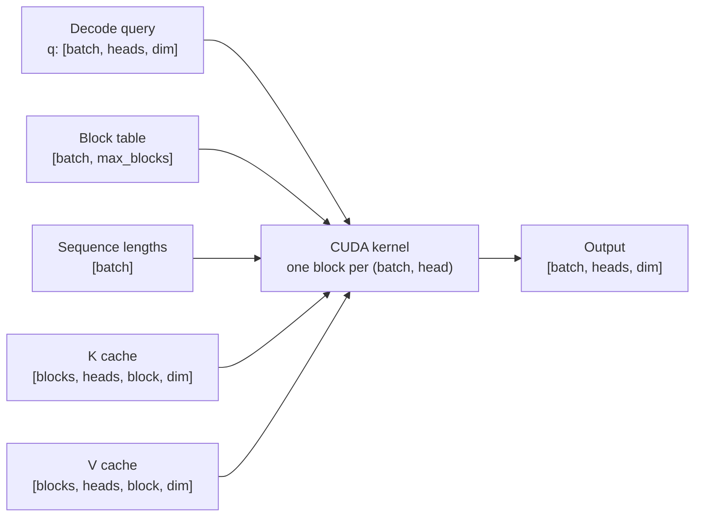

# Flash Decode Paged Attention

[](https://github.com/bojjachetan/flash-decode-paged-attention/actions/workflows/ci.yml)

CUDA/PyTorch implementation of decode-time attention over a paged KV cache for LLM inference.

This project was originally built as part of an undergraduate GPU programming project. It implements the attention step used during autoregressive generation, where each active sequence produces one token while attending over previously cached key/value states.

The KV cache is stored in fixed-size blocks, and a block table maps each sequence's logical cache blocks to physical cache blocks. The CUDA kernel computes attention directly over that paged layout using online softmax, avoiding materialization of the full attention matrix.

## Architecture



Core pieces:

- paged KV cache layout with block-table indirection
- one CUDA block per `(batch, head)` decode query
- block reduction for `q dot k`
- numerically stable online softmax
- PyTorch extension bindings
- PyTorch reference implementation for correctness
- benchmark and profiling scripts

## Documentation

- [Architecture and KV cache layout](docs/architecture.md)
- [Kernel notes and online softmax](docs/kernel_notes.md)
- [Correctness, benchmarks, and profiling](docs/performance.md)

## Project Layout

```text
csrc/
  bindings.cpp                 PyTorch extension bindings
  paged_attention_kernel.cu    CUDA kernel and launch checks
flash_decode/
  attention.py                 public API, reference path, CUDA dispatch
benchmarks/
  bench_decode_attention.py    latency and correctness benchmark
tests/
  test_attention.py            correctness tests for paged attention
docs/
  architecture.md              system diagram and paged cache layout
  kernel_notes.md              CUDA kernel and online softmax details
  performance.md               correctness, benchmark, and profiling notes
scripts/
  benchmark_matrix.sh          Reproducible benchmark table generator
  profile_nsys.sh              Nsight Systems profiling helper
  profile_ncu.sh               Nsight Compute profiling helper
```

## Install

```bash
python3 -m pip install -e .
python3 - <<'PY'
import torch
import flash_decode
print(torch.cuda.is_available())
print(flash_decode.cuda_extension_available())
PY
```

## Run Tests

```bash
python3 -m unittest discover -s tests
```

## Run Benchmarks

Reference benchmark:

```bash
python3 benchmarks/bench_decode_attention.py --device cpu --format markdown
```

CUDA benchmark:

```bash
python3 benchmarks/bench_decode_attention.py \
  --device cuda \
  --batch 8 \
  --heads 16 \
  --dim 128 \
  --seq-len 2048 \
  --block-size 16 \
  --dtype float16 \
  --format markdown
```

Benchmark matrix:

```bash
scripts/benchmark_matrix.sh cuda float16
```

## Profile

```bash
scripts/profile_nsys.sh
scripts/profile_ncu.sh
```

## API Example

```python
import torch
from flash_decode import make_paged_kv_cache, paged_attention

B, H, S, D = 4, 8, 1024, 128
q = torch.randn(B, H, D, device="cuda", dtype=torch.float16)
k = torch.randn(B, H, S, D, device="cuda", dtype=torch.float16)
v = torch.randn(B, H, S, D, device="cuda", dtype=torch.float16)

k_cache, v_cache, block_tables, seq_lens = make_paged_kv_cache(k, v, block_size=16)
out = paged_attention(q, k_cache, v_cache, block_tables, seq_lens)
```
