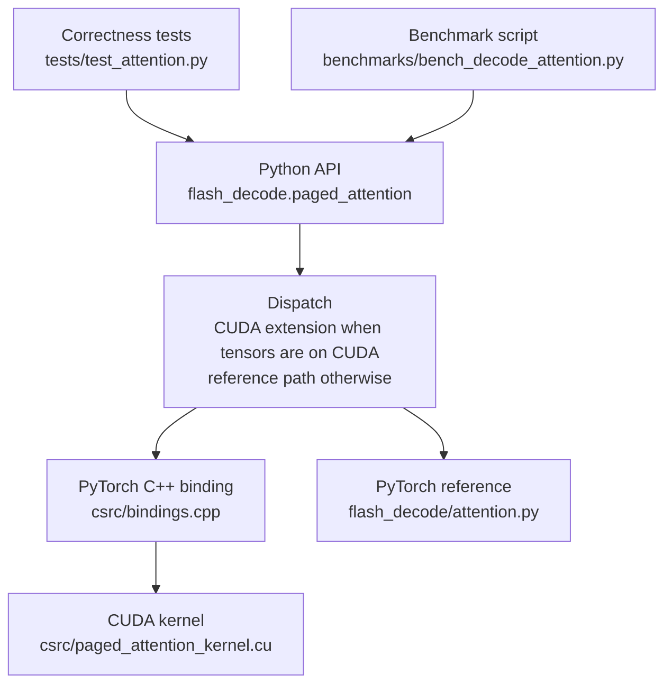
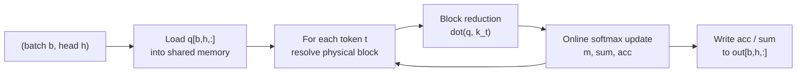

# Architecture

Flash Decode Paged Attention computes one decode-token attention result per active sequence and attention head:

```text
out[b, h] = softmax(q[b, h] @ K_cache[b, h].T / sqrt(head_dim)) @ V_cache[b, h]
```

The implementation is split into three layers:



## Paged KV Cache Layout

The cache is stored as physical blocks:

```text
k_cache:      [num_blocks, heads, block_size, head_dim]
v_cache:      [num_blocks, heads, block_size, head_dim]
block_tables: [batch, max_blocks_per_sequence]
seq_lens:     [batch]
q:            [batch, heads, head_dim]
out:          [batch, heads, head_dim]
```

Each row of `block_tables` maps a sequence's logical blocks to physical cache blocks.

Example with `block_size = 4`:

```text
sequence 0 tokens:  t0 t1 t2 t3 | t4 t5 t6 t7 | t8
logical blocks:       block 0    |    block 1   | block 2
block_tables[0]:          5      |      2       |   9

physical block 5 stores tokens t0..t3
physical block 2 stores tokens t4..t7
physical block 9 stores token  t8
```

For token index `t`:

```text
logical_block = t / block_size
block_offset  = t % block_size
physical_block = block_tables[b, logical_block]

k_token = k_cache[physical_block, h, block_offset, :]
v_token = v_cache[physical_block, h, block_offset, :]
```

This layout lets sequences occupy non-contiguous physical blocks while the attention kernel still sees a logical contiguous sequence.

## Decode Kernel Data Flow



The CUDA launch grid is:

```text
grid.x = batch
grid.y = heads
blockDim.x = 256
```

Each CUDA block owns exactly one `(batch, head)` pair. Threads cooperate to compute dot products, update the online softmax state, and write the output vector.

## Invariants

- `q`, `k_cache`, and `v_cache` use the same dtype.
- `q.shape == [batch, heads, head_dim]`.
- `k_cache.shape == v_cache.shape == [num_blocks, heads, block_size, head_dim]`.
- `block_tables` and `seq_lens` are `int32`.
- `head_dim <= 256`.
- Tensors passed into the CUDA extension are contiguous.

